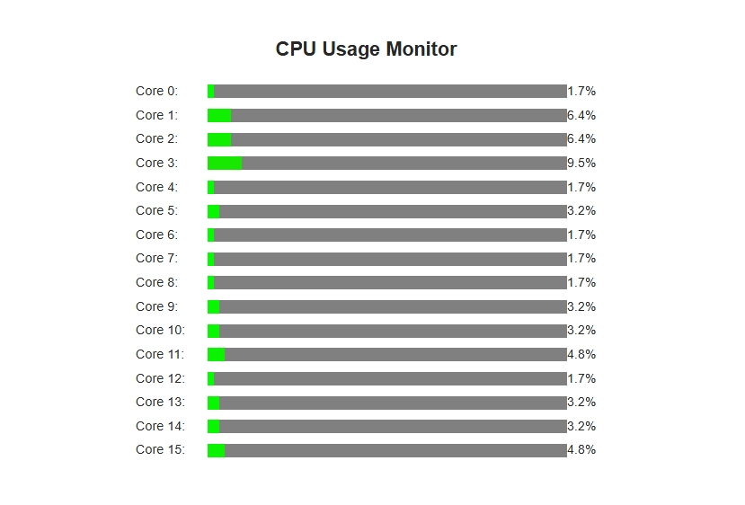

# CPU Monitor (Emby Plugin)

## Overview
The **CPU Monitor** plugin adds real-time CPU usage monitoring inside Emby Server.  
It provides administrators with a lightweight dashboard view, logging, and optional alerts when CPU usage crosses configurable thresholds.

This plugin is designed for **Emby Server 4.8.11.0** and is not compatible with Jellyfin or other forks.

---

## Features
- 📊 Display real-time CPU usage inside the Emby dashboard  
- 🔔 Configurable warning threshold with server notifications  
- 📝 Logging of CPU load over time  
- ⚡ Lightweight implementation using .NET APIs  
- 🎛 Easy configuration via the Emby admin panel  

---

## Installation

1. Download the latest release of **CPU_Monitor.dll** from the [Releases](../../releases) page.
2. Copy it into your Emby `plugins` directory:
   ```
   C:\Users\<YourUser>\AppData\Roaming\Emby-Server\plugins
   ```
   or on Linux:
   ```
   /var/lib/emby/plugins
   ```
3. Restart Emby Server.
4. Go to **Dashboard → Plugins → CPU Monitor** to configure settings.

---

## Configuration
- **Enable/Disable Monitoring** – Toggle the plugin  
- **Warning Threshold** – Percentage of CPU usage that triggers a notification  
- **Logging** – Enable or disable periodic logging to the Emby logs  

---

## Building from Source
If you want to compile the plugin yourself:

1. Clone the repository:
   ```bash
   git clone https://github.com/<YourUser>/CPU_Monitor.git
   ```
2. Open the solution in **Visual Studio 2022**.
3. Build in **Release** mode.
4. Copy the compiled `CPU_Monitor.dll` into your Emby `plugins` directory.

---

## Screenshots


---

## Roadmap
- [ ] Add per-core CPU graphing  
- [ ] Export logs to CSV  
- [ ] Add email alerts

---

## 🧑‍💻 Developers
**Author:** Mike Williams  

---

## Contributing
Pull requests are welcome!  
If you’d like to improve the plugin, please fork the repo and submit a PR.

---

## License
This project is licensed under the **MIT License** – see the [LICENSE](LICENSE) file for details.
